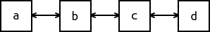

# CS100 Lecture 22

---

## Contents

Standard Template Library (STL)

- Overview
- Sequence containers and iterators
- Algorithms and function objects (aka "functors")
- Associative containers

---

# Overview of STL

---

## **S**tandard **T**emplate **L**ibrary

Added into C++ in 1994.

- Containers
- Iterators
- Algorithms
- Function objects
- Some other adapters, like container adapters and iterator adapters
- Allocators

---

## [Containers](https://en.cppreference.com/w/cpp/container)

- Sequence containers
  - `vector`, `list`, `deque`, `array` (since C++11), `forward_list` (since C++11)
- Associative containers
  - `set`, `map`, `multiset`, `multimap` (often implemented with *binary search trees*)
- Unordered associative containers (since C++11)
  - `unordered_set`, `unordered_map`, `unordered_multiset`, `unordered_multimap` (implemented with *hash tables*)
- Container adapters: provide a different interface for sequential containers, but they are not containers themselves.
  - `stack`, `queue`, `priority_queue`
  - (since C++23) `flat_set`, `flat_map`, `flat_multiset`, `flat_multimap`

---

## [Iterators](https://en.cppreference.com/w/cpp/iterator)

### Without iterators:

- Traverse an array
  ```cpp
  for (int i = 0; i != sizeof(a) / sizeof(a[0]); ++i)
    do_something(a[i]);
  ```
- Traverse a `vector`
  ```cpp
  for (std::size_t i = 0; i != v.size(); ++i)
    do_something(v[i]);
  ```
- Traverse a linked-list?
  ```cpp
  for (ListNode *p = l.head(); p; p = p->next)
    do_something(p->data);
  ```

---

## [Iterators](https://en.cppreference.com/w/cpp/iterator)

A generalization of pointers, used to access elements in different containers **in a uniform manner**.

### With iterators:

The following works no matter whether `c` is an array, a `std::string`, or any container.

```cpp
for (auto it = std::begin(c); it != std::end(c); ++it)
  do_something(*it);
```

**Equivalent way: range-based for loops**

```cpp
for (auto &x : c) do_something(x);
```

---

## [Algorithms](https://en.cppreference.com/w/cpp/algorithm)

The algorithms library defines functions for a variety of purposes:
- searching, sorting, counting, manipulating, ...

Examples:

```cpp
// assign every element in `a` with the value `x`.
std::fill(a.begin(), a.end(), x);
// sort the elements in `b` in ascending order.
std::sort(b.begin(), b.end());
// find the first element in `b` that is equal to `x`.
auto pos = std::find(b.begin(), b.end(), x);
// reverse the elements in `c`.
std::reverse(c.begin(), c.end());
```

---

## [Algorithms](https://en.cppreference.com/w/cpp/algorithm)

Example: Map every number in `data` to its rank. (“离散化”)

```cpp
auto remap(const std::vector<int> &data) {
  auto tmp = data;
  std::sort(tmp.begin(), tmp.end()); // sort
  auto pos = std::unique(tmp.begin(), tmp.end()); // drop duplicates
  auto ret = data;
  for (auto &x : ret)
    x = std::lower_bound(tmp.begin(), pos, x) - tmp.begin(); // binary search
  return ret;
}
```

---

## Function objects

Things that look like "functions": *Callable*
- functions, and also function pointers
- objects of a class type that has an overloaded `operator()` (the function-call operator)
- lambda expressions

More in later lectures ...

---

# Sequence containers and iterators

Note: `string` is not treated as a container but behaves much like one.

---

## Sequence containers

- `std::vector<T>`: dynamic contiguous array (we are quite familiar with)

<a align="center">
  
</a>

- `std::deque<T>`: **d**ouble-**e**nded **que**ue (often pronounced as "deck")
  - `std::deque<T>` supports fast insertion and deletion **at both its beginning and its end**. (`push_front`, `pop_front`, `push_back`, `pop_back`)

<a align="center">
  
</a>

- `std::array<T, N>`: same as `T[N]`, it is a **container**
  - It will never decay to `T *`.
  - Container interfaces are provided: `.at(i)`, `.front()`, `.back()`, `.size()`, ..., as well as iterators.

---

## Sequence containers

- `std::list<T>`: doubly-linked list
  - `std::list<T>` supports fast insertion and deletion **anywhere in the container**,
  - but fast random access is not supported (i.e. no `operator[]`).
  - Bidirectional traversal is supported.

<a align="center">
  
</a>

- `std::forward_list<T>`: singly-linked list
  - Intended to save time and space (compared to `std::list`).
  - Only forward traversal is supported.

<a align="center">
  
</a>

---

## Interfaces

STL containers have consistent interfaces. See [here](https://en.cppreference.com/w/cpp/container#Member_function_table) for a full list.

Element access:

- `c.at(i)`, `c[i]`: access the element indexed `i`. `at` performs bounds checking, and throws `std::out_of_range` if `i` exceeds the valid range.
- `c.front()`, `c.back()`: access the front/back element.

---

## Interfaces

Size and capacity: `c.size()` and `c.empty()` are what we already know.

- `c.resize(n)`, `c.resize(n, x)`: adjust the container to be with exactly `n` elements. If `n > c.size()`, `n - c.size()` elements will be appended.
  - `c.resize(n)`: Appended elements are **value-initialized**.
  - `c.resize(n, x)`: Appended elements are copies of `x`.
- `c.capacity()`, `c.reserve(n)`, `c.shrink_to_fit()`: only for `string` and `vector`.
  - `c.capacity()` returns the capacity (number of elements that *can* be stored in the current storage)
  - `c.reserve(n)`: reserves space for at least `n` elements.
  - `c.shrink_to_fit()`: requests to remove the unused capacity, so that `c.capacity() == c.size()`.

---

## Interfaces

Modifiers:

- `c.push_back(x)`, `c.emplace_back(args...)`, `c.pop_back()`: insert/delete elements at the end of the container.
- `c.push_front(x)`, `c.emplace_front(args...)`, `c.pop_front()`: insert/delete elements at the beginning of the container.
- `c.clear()` removes all the elements in `c`.

---

## Interfaces

Modifiers:

- `c.insert(...)`, `c.emplace(...)`, `c.erase(...)`: insert/delete elements at a specified location.
  - **Warning**: For containers that need to maintain contiguous storage (`string`, `vector`, `deque`), insertion and deletion somewhere in the middle can be **very slow** ($O(n)$).
  - These functions have a lot of overloads. Remember a few common ones, and STFW (Search The Friendly Web) when you need to use them.

---

## Interfaces

Some of these member functions are not supported on some containers, **depending on the underlying data structure**. For example:
- Any operation that modifies the length of the container is not allowed for `array`.
- `push_front`, `emplace_front` and `pop_front` are not supported on `string`, `vector` and `array`.
- `size` is not supported on `forward_list` in order to save time and space.
- `operator[]` and `at` are not supported on linked-lists.

[This table](https://en.cppreference.com/w/cpp/container#Member_function_table) tells you everything.

---

## Iterators

A generalized "pointer" used for accessing elements in different containers.

Every container has its iterator: `Container::iterator`. e.g. `std::vector<int>::iterator`, `std::forward_list<std::string>::iterator`

- `auto` comes to our rescue!

`c.begin()` returns the iterator to the first element of `c`.

`c.end()` returns the iterator to **the element following the last element** of `c`.

<a align="center">
  
</a>

---

## Iterators

A pair of iterators (`b`, `e`) is often used to indicate a range `[b, e)`.

Such ranges are **left-inclusive**. Benefits:

- `e - b` is the **length** of the range, i.e. the number of elements. There is no extra `+1` or `-1`.
- If `b == e`, the range is empty.

---

## Iterators

Basic operations, supported by almost all kinds of iterators:

- `*it`: returns a reference to the element that `it` refers to.
- `it->mem`: equivalent to `(*it).mem`.
- `++it`, `it++`: moves `it` one step forward, so that `it` refers to the "next" element.
  - `++it` returns a reference to `it`, while `it++` returns a copy of `it` before incrementation.
- `it1 == it2`: checks whether `it1` and `it2` refer to the same position in the container.
- `it1 != it2`: equivalent to `!(it1 == it2)`.

These are supported by the iterators of all sequence containers, as well as `string`.

---

## Iterators

Use the basic operations to traverse a sequence container:

```cpp
void swapcase(std::string &str) {
  for (auto it = str.begin(); it != str.end(); ++it) {
    if (std::islower(*it))
      *it = std::toupper(*it);
    else if (std::isupper(*it))
      *it = std::tolower(*it);
  }
}
void print(const std::list<int> &lst) {
  for (auto it = lst.begin(); it != lst.end(); ++it)
    std::cout << *it << ' ';
}
```

---

## Iterators

**Built-in pointers are also iterators**: They are the iterator for built-in arrays.

For an array `Type a[N]`:

- The "begin" iterator is `a`.
- The "end" (off-the-end) iterator is `a + N`.

The standard library functions `std::begin(c)` and `std::end(c)` (defined in `<iterator>` and many other header files):

- return `c.begin()` and `c.end()` if `c` is a container;
- return `c` and `c + N` if `c` is an array of length `N`.

---

## Range-for demystified

The range-based for loop

```cpp
for (@declaration : container)
  @loop_body
```

is equivalent to 

```cpp
{
  auto b = std::begin(container);
  auto e = std::end(container);
  for (; b != e; ++b) {
    @declaration = *b;
    @loop_body
  }
}
```

---

## Iterators: dereferenceable

Like pointers, an iterator can be dereferenced (`*it`) only when it refers to an existing element. (**"dereferenceable"**)

- `*v.end()` is undefined behavior.
- `++it` is undefined behavior if `it` is not dereferenceable. In other words, moving an iterator out of the range `[begin, off_the_end]` is undefined behavior.

---

## Iterators: invalidation

```cpp
Type *storage = new Type[n];
Type *iter = storage;
delete[] storage;
// Now `iter` does not refer to any existing element.
```

Some operations on some containers will **invalidate** some iterators:
- make these iterators not refer to any existing element.

For example:
- `push_back(x)` on a `vector` may cause the reallocation of storage. All iterators obtained previously are invalidated.
- Deleting an element in a `list` will invalidate the iterator referring to that element.

---

## More operations on iterators

The iterators of containers that support `*it`, `it->mem`, `++it`, `it++`, `it1 == it2` and `it1 != it2` are [**ForwardIterators**](https://en.cppreference.com/w/cpp/named_req/ForwardIterator).

[**BidirectionalIterator**](https://en.cppreference.com/w/cpp/named_req/BidirectionalIterator): a ForwardIterator that can be moved in both directions
- supports `--it` and `it--`.

[**RandomAccessIterator**](https://en.cppreference.com/w/cpp/named_req/RandomAccessIterator): a BidirectionalIterator that can be moved to point to any element in constant time.
- supports `it + n`, `n + it`, `it - n`, `it += n`, `it -= n` for an integer `n`.
- supports `it[n]`, equivalent to `*(it + n)`.
- supports `it1 - it2`, returns the **distance** of two iterators.
- supports `<`, `<=`, `>`, `>=`.

---

## Iterator categories

[**ForwardIterators**](https://en.cppreference.com/w/cpp/named_req/ForwardIterator): supports `*it`, `it->mem`, `++it`, `it++`, `it1 == it2`, `it1 != it2`

[**BidirectionalIterator**](https://en.cppreference.com/w/cpp/named_req/BidirectionalIterator): a ForwardIterator that can be moved in both directions
- supports `--it` and `it--`.

[**RandomAccessIterator**](https://en.cppreference.com/w/cpp/named_req/RandomAccessIterator): a BidirectionalIterator that can be moved to point to any element in constant time.
- supports `it + n`, `n + it`, `it - n`, `it += n`, `it -= n` for an integer `n`.
- supports `it[n]`, equivalent to `*(it + n)`.
- supports `it1 - it2`, returns the **distance** of two iterators.
- supports `<`, `<=`, `>`, `>=`.

**\* Which category is the built-in pointer in?**

---

## Iterator categories

[**ForwardIterators**](https://en.cppreference.com/w/cpp/named_req/ForwardIterator): supports `*it`, `it->mem`, `++it`, `it++`, `it1 == it2`, `it1 != it2`

[**BidirectionalIterator**](https://en.cppreference.com/w/cpp/named_req/BidirectionalIterator): a ForwardIterator that can be moved in both directions
- supports `--it` and `it--`.

[**RandomAccessIterator**](https://en.cppreference.com/w/cpp/named_req/RandomAccessIterator): a BidirectionalIterator that can be moved to point to any element in constant time.
- supports `it + n`, `n + it`, `it - n`, `it += n`, `it -= n` for an integer `n`.
- supports `it[n]`, equivalent to `*(it + n)`.
- supports `it1 - it2`, returns the **distance** of two iterators.
- supports `<`, `<=`, `>`, `>=`.

**\* Which category is the built-in pointer in?** - RandomAccessIterator.

---

## Iterator categories

[**ForwardIterators**](https://en.cppreference.com/w/cpp/named_req/ForwardIterator): an iterator that can be moved forward.
- `forward_list<T>::iterator`

[**BidirectionalIterator**](https://en.cppreference.com/w/cpp/named_req/BidirectionalIterator): a ForwardIterator that can be moved in both directions
- `list<T>::iterator`

[**RandomAccessIterator**](https://en.cppreference.com/w/cpp/named_req/RandomAccessIterator): a BidirectionalIterator that can be moved to point to any element in constant time.
- `string::iterator`, `vector<T>::iterator`, `deque<T>::iterator`, `array<T,N>::iterator`

---

## Iterator categories

To know the category of an iterator of a container, consult its type alias member `iterator_category`.

```cpp
using vec_iter = std::vector<int>::iterator;
using category = vec_iter::iterator_category;
```

Put your mouse on `category`, and the IDE will tell you what it is.

It is one of the following tags: `std::forward_iterator_tag`, `std::bidirectional_iterator_tag`, `std::random_access_iterator_tag`.

Note: There are two other categories: InputIterator and OutputIterator. They may (or may not) be covered in later lectures.

---

## Constructors of containers

All sequence containers can be constructed in the following ways:

- `Container c(b, e)`, where `[b, e)` is an **iterator range**.
  - Copies elements from the iterator range `[b, e)`.
- `Container c(n, x)`, where `n` is a nonnegative integer and `x` is a value.
  - Initializes the container with `n` copies of `x`.
- `Container c(n)`, where `n` is a nonnegative integer.
  - Initializes the container with `n` elements. All elements are **value-initialized**.
  - This is not supported by `string`. (Why?)

---

## Constructors of containers

All sequence containers can be constructed in the following ways:

- `Container c(b, e)`, where `[b, e)` is an **iterator range**.
  - Copies elements from the iterator range `[b, e)`.
- `Container c(n, x)`, where `n` is a nonnegative integer and `x` is a value.
  - Initializes the container with `n` copies of `x`.
- `Container c(n)`, where `n` is a nonnegative integer.
  - Initializes the container with `n` elements. All elements are **value-initialized**.
  - This is not supported by `string`, because it is meaningless to have `n` value-initializes `char`s (all of them will be `'\0'`)!

---

# Algorithms and function objects

---

## Algorithms

Full list of standard library algorithms can be found [here](https://en.cppreference.com/w/cpp/algorithm).

No one can remember all of them, but some are quite commonly used.

---

## Algorithms: interfaces

**Parameters**: The STL algorithms accept pairs of iterators to represent "ranges":

```cpp
int a[N], b[N]; std::vector<int> v;
std::sort(a, a + N);
std::sort(v.begin(), v.end());
std::copy(a, a + N, b); // copies elements in [a, a+N) to [b, b+N)
std::sort(v.begin(), v.begin() + 10); // Only the first 10 elements are sorted.
```

(since C++20) `std::ranges::xxx` can be used, which has more modern interfaces

```cpp
std::ranges::sort(a);
std::ranges::copy(a, b);
```

---

## Algorithms: interfaces

**Parameters**: The algorithms suffixed `_n` use **a beginning iterator `begin` and an integer `n` to represent a range `[begin, begin + n)`**.

Example: Use STL algorithms to rewrite the constructors of `Dynarray`:

```cpp
Dynarray::Dynarray(const int *begin, const int *end)
    : m_storage{new int[end - begin]}, m_length{end - begin} {
  std::copy(begin, end, m_storage);
}
Dynarray::Dynarray(const Dynarray &other)
    : m_storage{new int[other.size()]}, m_length{other.size()} {
  std::copy_n(other.m_storage, other.size(), m_storage);
}
Dynarray::Dynarray(std::size_t n, int x = 0)
    : m_storage{new int[n]}, m_length{n} {
  std::fill_n(m_storage, m_length, x);
}
```

---

## Algorithms: interfaces

**Return values**: "Position" is represented by an iterator. For example:

```cpp
std::vector<int> v = someValues();
auto pos = std::find(v.begin(), v.end(), 42);
assert(*pos == 42);
auto maxPos = std::max_element(v.begin(), v.end());
```

- `pos` is an **iterator** pointing to the first occurrence of `42` in `v`.
- `maxPos` is an **iterator** pointing to the max element in `v`.

---

## Algorithms: requirements

An algorithm may have **requirements** on
- the iterator categories of the passed-in iterators, and
- the type of elements that the iterators point to.

Typically, `std::sort` requires *RandomAccessIterator*s, while `std::copy` allows any *InputIterator*s.

Typically, all algorithms that need to compare elements rely only upon `operator<` and `operator==` of the elements.
- You don't have to define all the six comparison operators of `X` in order to `sort` a `vector<X>`. `sort` only requires `operator<`.

---

## Algorithms

Since we pass **iterators** instead of **containers** to algorithms, **the standard library algorithms never modify the length of the containers**.

- STL algorithms never insert or delete elements in the containers (unless the iterator passed to them is some special *iterator adapter*).

For example: `std::copy` only **copies** elements, instead of inserting elements.

```cpp
std::vector<int> a = someValues();
std::vector<int> b(a.size());
std::vector<int> c{};
std::copy(a.begin(), a.end(), b.begin()); // OK
std::copy(a.begin(), a.end(), c.begin()); // Undefined behavior!
```

---

## Some common algorithms (`<algorithm>`)

Non-modifying sequence operations:

- `count(begin, end, x)`, `find(begin, end, x)`, `find_end(begin, end, x)`, `find_first_of(begin, end, x)`, `search(begin, end, pattern_begin, pattern_end)`

Modifying sequence operations:

- `copy(begin, end, dest)`, `fill(begin, end, x)`, `reverse(begin, end)`, ...
- `unique(begin, end)`: drop duplicate elements.
  - requires the elements in the range `[begin, end)` to be **sorted** (in ascending order by default).
  - **It does not remove any elements!** Instead, it moves all the duplicated elements to the end of the sequence, and returns an iterator `pos`, so that `[begin, pos)` has no duplicate elements.

---

## Some common algorithms (`<algorithm>`)

Example: `unique`

```cpp
std::vector v{1, 1, 2, 2, 2, 3, 5};
auto pos = std::unique(v.begin(), v.end());
// Now [v.begin(), pos) holds {1, 2, 3, 5},
// and [pos, v.end()) holds {1, 2, 2}, but the exact order is not known.
v.erase(pos, v.end()); // Typical use with the container's `erase` operation
// Now v holds {1, 2, 3, 5}.
```

`unique` does not remove the duplicate elements! To remove them, use the container's `erase` operation.

---

## Some common algorithms (`<algorithm>`)

Partitioning, sorting and merging algorithms:

- `partition`, `is_partitioned`, `stable_partition`
- `sort`, `is_sorted`, `stable_sort`
- `nth_element`
- `merge`, `inplace_merge`

Binary search on sorted ranges:

- `lower_bound`, `upper_bound`, `binary_search`, `equal_range`

Heap algorithms:

- `is_heap`, `make_heap`, `push_heap`, `pop_heap`, `sort_heap`

Learn the underlying algorithms and data structures of these functions in CS101!

---

## Some common algorithms

Min/Max and comparison algorithms: (`<algorithm>`)

- `min_element(begin, end)`, `max_element(begin, end)`, `minmax_element(begin, end)`
- `equal(begin1, end1, begin2)`, `equal(begin1, end1, begin2, end2)`
- `lexicographical_compare(begin1, end1, begin2, end2)`

Numeric operations: (`<numeric>`)

- `accumulate(begin, end, initValue)`: Sum of elements in `[begin, end)`, with initial value `initValue`.
  - `accumulate(v.begin(), v.end(), 0)` returns the sum of elements in `v`.
- `inner_product(begin1, end1, begin2, initValue)`: Inner product of two vectors $\mathbf{a}^T\mathbf{b}$, added with the initial value `initValue`.

---

